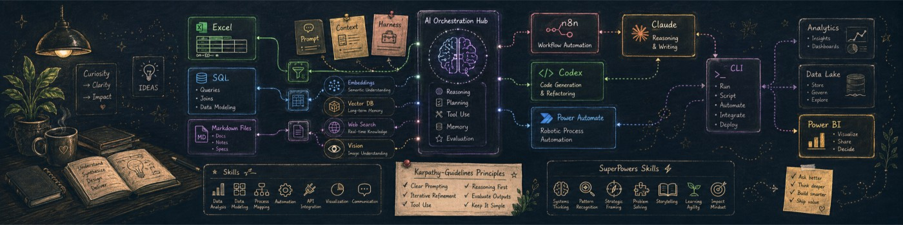

# W.K. CHEONG

**Business Analyst (Finance) × AI orchestration — building software by swinging the wand.**

Sixteen years from manufacturing IT operations in Malaysia to AI orchestration. I ship
AI-assisted tooling and automation the disciplined way — spec written before code, every
interaction verified with real browser probes, every build documented like it matters.

## ✨ Featured

**[Portfolio_Web_Alley618](https://github.com/Aquivus-AI/Portfolio_Web_Alley618)** — the
public write-up of **[alley618.dev](https://alley618.dev)**: a cinematic, scroll-driven
portfolio told in seven animated scenes — an owl delivers the portrait, a quill writes the
career journey, and a spider spins the contact links into its web. Built in an
AI-orchestrated workflow (~65 rounds, ~375M tokens) on Next.js 15 + Cloudflare Workers,
with a 173 kB First Load budget and 162 automated interaction checks on the contact scene
alone.

## 🧰 The toolkit

**Web:** Next.js · React · TypeScript · Tailwind CSS · framer-motion · Three.js
**Infra:** Cloudflare Workers · Durable Objects · push-to-deploy CI
**AI workflow:** Claude Code · spec-first pipelines · subagent orchestration · headless-Chrome verification
**Day job:** SQL · Power BI · Excel automation · finance process analysis

## 📫 Owl post

The fastest perch is the contact web on **[alley618.dev](https://alley618.dev)** — scroll
to the end and send an owl.
